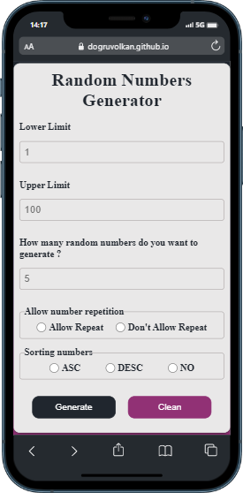

# Random Number Generator:

### Proje özeti :

> Proje React ile yazıldı temel amaç kullanıcının girdiği 2 sayı arasında random sayılar üretmektir.

### Proje durumu ve yapılacaklar :

- [x] girilen 2 sayı arasında random sayı üretmek.
- [x] responsive tasarım.
- [x] girilen sayı adedi kadar random sayı üretmek
- [x] Üretilen random sayıları büyükten küçüğe ya da küçükten büyüğe sıralama
- [ ] sayı tekrarına izin verme vermeme
- [x] random oluşturulan sayıları kopyalama işlemi

### Projede kullanılan Teknolojiler ve Metotlar :

> Projede useState hook kullanıldı. stilendirme için herhangi bir kütüphane kullanılmadı pure css ile stilendirme yapıldı.
react-copy-to-clipboard kullanıldı.
React Icons kullanıldı.
gh-pages kullanıldı.

### proje font ve renk:
(#20262E)
(#913175)
(#E9E8E8)

### Proje Adresi

[random-number](https://dogruvolkan.github.io/random-number)

### Projenin Görselleri:

